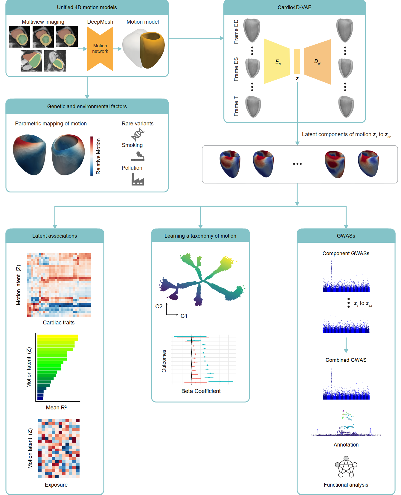

# Genetic–exposome axis orchestrates cardiac motion patterns

This repository contains the code and models used to study large-scale patterns of human 
cardiac motion using four-dimensional cardiac MRI from UK Biobank. We use deep, 
unsupervised representation learning to capture dynamic left-ventricular motion, derive 
compact latent descriptors of spatiotemporal deformation, and link these motion traits to 
genetic, environmental, clinical factors, and cardivascular outcomes. These latent motion signatures reveal 
fine-grained functional and developmental programmes of the heart that are not detectable 
from standard clinical imaging metrics.

---

## Cardio4D-VAE

Cardio4D-VAE is a spatiotemporal β-VAE trained on dynamic 3D+t left-ventricular mesh 
sequences. It learns a 32-dimensional probabilistic latent representation that captures 
anatomical shape and temporal deformation throughout the cardiac cycle.  
The extracted latent features form the basis for downstream unsupervised analysis, 
genetic association, clustering, and risk modelling.

---

## Downstream Analysis

Latent embeddings can be used for:

- Taxonomy of cardiac motion 
- Genotype–phenotype association
- Environmental and exposome association  
- Motion-based risk stratification  
- Biomechanical interpretation of cardiac function  

These analyses enable multiscale integration of motion traits with molecular, 
environmental, and clinical data.

---

## Applications

- 4D cardiac motion representation  
- Unsupervised motion phenotyping  
- Population stratification  
- Cardiac biomechanics  
- Large-scale imaging genetics  
- Phenotype discovery and endophenotyping

---

## Citation

If you use this repository, please cite the associated publication (to be added).

---

## Contact

For questions or collaborations, please reach out via GitHub issues or email (s.kalaie@imperial.ac.uk).
